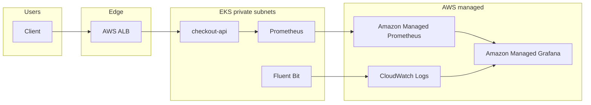

# Architecture — production-ready AWS platform

This repository is a **portfolio-grade** reference for a multi-AZ EKS platform. It is designed to be applied in a real AWS account after substituting `CHANGE_ME` values (state bucket, account IDs, CIDRs, ACM certificates).

## Goals

| Goal | How it is met |
| --- | --- |
| Repeatable infrastructure | Terraform modules for VPC, EKS, AMP/AMG, composed per environment |
| GitOps | Kustomize base + overlays; GitHub Actions apply from `main` |
| Production defaults | Private nodes, KMS secrets encryption, IRSA, PDBs, HPA, NetworkPolicies |
| Observability | RED + USE dashboards, SLO burn alerts, Fluent Bit → CloudWatch, AMP remote write |
| Change safety | fmt/validate/tflint/checkov + kubeconform on PRs; prod apply gated to `main` |
| Disaster recovery | Multi-AZ NAT, documented RPO/RTO, `scripts/dr_backup.sh` |

## Context diagram

## Design decisions

### Networking

- Three-tier intent: public subnets only for ALB and NAT; workloads stay in private subnets.
- **Dev** uses a single NAT gateway to control cost. **Prod** uses one NAT per AZ to survive AZ loss without SNAT concentration.
- Gateway + Interface VPC endpoints for S3 and ECR reduce NAT cost and keep image pulls on the AWS network.
- VPC Flow Logs are on by default for forensic and compliance use.

### Kubernetes / EKS

- Control plane logs (`api`, `audit`, `authenticator`, `controllerManager`, `scheduler`) go to CloudWatch.
- Envelope encryption of Kubernetes secrets uses a dedicated KMS key with rotation.
- Add-ons: vpc-cni, CoreDNS, kube-proxy, EBS CSI (IRSA).
- IRSA roles: AWS Load Balancer Controller, Cluster Autoscaler, AMP remote write, Fluent Bit.
- Workloads run with restricted Pod Security labels, drop ALL capabilities, read-only root filesystem, and no automounted API tokens unless required.

### GitOps and deployments

- **Kustomize** (not Helm for the app) keeps overlays reviewable as YAML diffs.
- Prod overlay includes a **green Service** plus ALB weighted `forwardConfig` for blue/green. `scripts/blue_green_shift.sh` changes weights without rebuilding the overlay.
- Rollouts use `maxUnavailable: 0` so capacity is replaced before pods are terminated. PDBs block drain of the last replica.

### Observability

- In-cluster Prometheus (kube-prometheus-stack) **remote-writes** to Amazon Managed Prometheus so metrics survive cluster rebuilds.
- Amazon Managed Grafana queries AMP and CloudWatch; JSON dashboards live in git.
- SLOs are encoded as recording rules + alerts (see below), not only dashboard panels.
- Logs: Fluent Bit DaemonSet with CRI parser → CloudWatch log group created in Terraform.

### Identity and CI

- GitHub Actions assume an AWS IAM role via OIDC (`id-token: write`). There are no long-lived access keys in workflows.
- `environment:` protection rules should require reviewers for `prod`.

## SLA / SLO

These targets apply to the sample **checkout-api** as if it were a revenue path.

| Indicator | Target | Window | Error budget |
| --- | --- | --- | --- |
| Availability SLO | 99.9% successful (non-5xx) HTTP | 30 days | 0.1% ≈ 43 minutes |
| Latency SLO | p99 < 500 ms | 30 days | Fast-burn alert at 5m |
| Platform SLA (internal) | EKS API + node Ready | 99.95% monthly | NodeNotReady pages at 5m |

Alerting uses a **simple burn** on 5m availability versus 99.9%. In a larger org this would be multi-window multi-burn (Google SRE workbook). The structure is already in PrometheusRule form so the math can be swapped without changing routing.

## Disaster recovery

| Item | RPO | RTO | Strategy |
| --- | --- | --- | --- |
| Terraform state | 0 (S3 versioning) | < 30 min | Versioned encrypted bucket + DynamoDB lock |
| Kubernetes desired state | 0 | < 30 min | Git is source of truth; `kustomize build \| kubectl apply` |
| Cluster (EKS) | n/a (managed) | 1–4 h | Recreate cluster in same or DR region from Terraform |
| Metrics | ~5 min | < 15 min | AMP is outside the cluster |
| Logs | ~5 min | < 15 min | CloudWatch retention 14d (dev) / 90d (prod) |
| Application data | *out of scope* | *out of scope* | Demo API is stateless; real apps would use Multi-AZ RDS + PITR |

**Regional DR (warm standby):** `prod` exposes `region_dr` (default `us-west-2`). Stand up a second stack with a distinct state key (`prod-dr/terraform.tfstate`), replicate container images in ECR, and shift Route 53 weighted records after `scripts/cluster_health.sh` is green.

**Backup job:** `scripts/dr_backup.sh prod` pulls Terraform state, dumps live API objects, and stores a tarball in the DR bucket.

## Threat model (abbreviated)

- Untrusted traffic only reaches ALB; nodes have no public IPs.
- IRSA scopes AWS API access per service account; node instance role is not used by apps.
- NetworkPolicies default-deny style for the sample API (ingress from kube-system + observability only — expand for mesh/ALB target groups as needed).
- Public EKS endpoint CIDRs must be tightened in prod `tfvars`.

## What this is not

- It is not a drop-in for every AWS organization (no AWS Organizations/SCP module).
- ACM certificates, Route 53 hosted zones, and WAF are left as annotations/variables so the repo stays account-agnostic.
- Amazon Managed Grafana SSO assignment is account-specific (IAM Identity Center).
