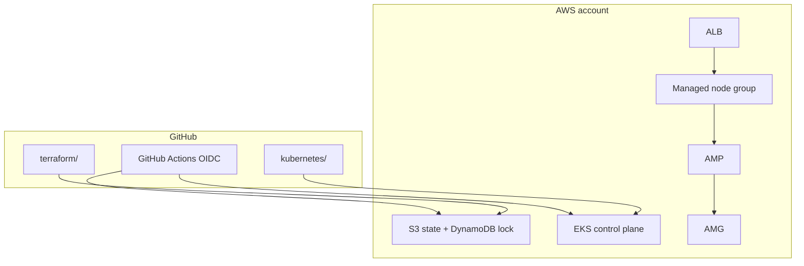
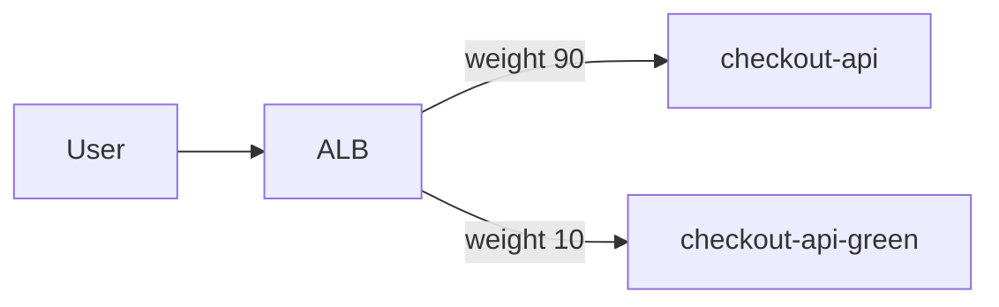

# Diagrams

Use these with any Mermaid renderer (GitHub, many IDEs).

## Control vs data plane

```mermaid
flowchart TB
  subgraph git [GitHub]
    TF[terraform/]
    K[kubernetes/]
    GHA[GitHub Actions OIDC]
  end
  subgraph awsacc [AWS account]
    S3[S3 state + DynamoDB lock]
    EKS[EKS control plane]
    Nodes[Managed node group]
    ALB[ALB]
    AMP[AMP]
    AMG[AMG]
  end
  GHA --> S3
  GHA --> EKS
  TF --> S3
  K --> EKS
  ALB --> Nodes
  Nodes --> AMP
  AMP --> AMG
```

## Blue / green traffic

```mermaid
flowchart LR
  User --> ALB
  ALB -->|weight 90| Blue[checkout-api]
  ALB -->|weight 10| Green[checkout-api-green]
```
